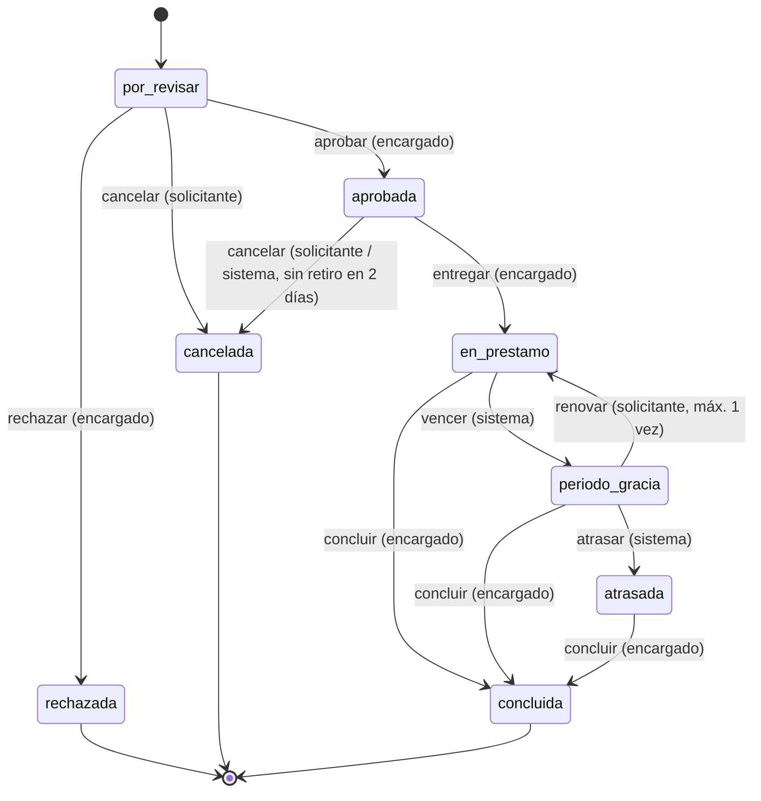

# Estados y transiciones del préstamo

Fuente de verdad en el código: `src/prestamos/estados.py`. Si esta tabla y el
código difieren, gana el código y este documento debe corregirse.

## Diagrama

## Tabla de transiciones

| Estado origen | Acción | Estado destino | Roles autorizados | Condiciones que impiden la operación |
| --- | --- | --- | --- | --- |
| por_revisar | aprobar | aprobada | encargado | Algún equipo dejó de estar disponible entre la creación y la aprobación |
| por_revisar | rechazar | rechazada | encargado | Motivo vacío |
| por_revisar | cancelar | cancelada | solicitante (dueño), encargado | La solicitud no es del solicitante |
| aprobada | entregar | en_prestamo | encargado | Pasaron más de 2 días desde la aprobación |
| aprobada | cancelar | cancelada | solicitante (dueño), encargado, sistema | — |
| en_prestamo | vencer | periodo_gracia | sistema | Aún no llega la fecha de devolución |
| en_prestamo | concluir | concluida | encargado | — |
| periodo_gracia | renovar | en_prestamo | solicitante (dueño), encargado | Ya usó su única renovación, o pide más de 7 días |
| periodo_gracia | concluir | concluida | encargado | — |
| periodo_gracia | atrasar | atrasada | sistema | Aún no vence el período de gracia (1 día) |
| atrasada | concluir | concluida | encargado | — |

Los estados `rechazada`, `cancelada` y `concluida` son finales: no admiten
ninguna acción. La prueba CP-09 lo verifica.

## Transiciones automáticas

Las ejecuta `servicios.prestamos.actualizar_estados_por_fecha()` al arrancar la
aplicación, con el rol `sistema`. Ninguna persona puede dispararlas a mano.

| Condición | Efecto |
| --- | --- |
| Hoy supera `fecha_devolucion` y el estado es `en_prestamo` | Pasa a `periodo_gracia` |
| Hoy supera `fecha_devolucion + 1 día` y el estado es `periodo_gracia` | Pasa a `atrasada` y el solicitante queda `pendiente` |
| Pasaron más de 2 días desde la aprobación sin retiro | Pasa a `cancelada` |

## Cálculo de la disponibilidad

Implementado en `src/prestamos/disponibilidad.py`.

Un equipo está disponible cuando se cumplen las dos condiciones:

1. Su campo `estado` no es `fuera_de_servicio`, que es la única marca manual
   que el encargado puede poner sobre una unidad.
2. Ninguna solicitud en estado activo lo incluye. Los estados activos son
   `por_revisar`, `aprobada`, `en_prestamo`, `periodo_gracia` y `atrasada`.

Consecuencias buscadas de esta definición:

- **Una solicitud sin aprobar ya bloquea el equipo.** Esto resuelve la carrera
  entre dos personas que piden la misma unidad: gana quien registra primero, y
  la segunda persona recibe un error explicando qué solicitud lo tiene tomado.
- **`aprobada` y `en_prestamo` ocupan exactamente igual.** Era una de las
  ambigüedades abiertas y se cerró así por simplicidad y por seguridad.
- **No hay disponibilidad por rango de fechas.** Como un préstamo puede
  extenderse una semana más, no se garantiza que la unidad se desocupe en una
  fecha futura, así que se bloquea completa mientras la solicitud viva.
- **El estado del equipo se deriva, no se duplica.** El JSON de equipos no
  guarda `en_uso`: ese valor se calcula leyendo las solicitudes activas, de
  modo que no puede quedar desincronizado.
