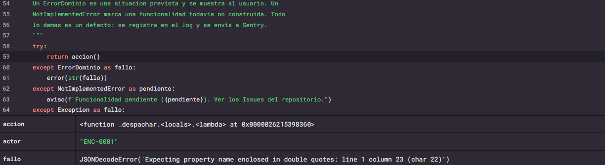

**Issue ID:** 7715896391
**Project:** pruebas-de-software

## Title
JSONDecodeError: Expecting property name enclosed in double quotes: line 1 column 23 (char 22)
**Culprit:** prestamos.almacen in leer
**Date:** 2026-09-06 21:09:57 UTC

## Evidence



## Exception
JSONDecodeError: Expecting property name enclosed in double quotes: line 1 column 23 (char 22)
**Handled:** Yes
```
raw_decode in json\decoder.py [Line 361] (Not in app)
        This can be used to decode a JSON document from a string that may
        have extraneous data at the end.

        """
        try:
            obj, end = self.scan_once(s, idx)  <-- SUSPECT LINE
        except StopIteration as err:
            raise JSONDecodeError("Expecting value", s, err.value) from None
        return obj, end
vars: idx='0', s='\'[{"codigo": "LAP-001",\'', self='<json.decoder.JSONDecoder object at 0x0000026213371D30>'
------
decode in json\decoder.py [Line 345] (Not in app)
    def decode(self, s, _w=WHITESPACE.match):
        """Return the Python representation of ``s`` (a ``str`` instance
        containing a JSON document).

        """
        obj, end = self.raw_decode(s, idx=_w(s, 0).end())  <-- SUSPECT LINE
        end = _w(s, end).end()
        if end != len(s):
            raise JSONDecodeError("Extra data", s, end)
        return obj

vars: _w='<built-in method match of re.Pattern object at 0x000002621336A4D0>', s='\'[{"codigo": "LAP-001",\'', self='<json.decoder.JSONDecoder object at 0x0000026213371D30>'
------
loads in __init__.py [Line 346] (Not in app)
        s = s.decode(detect_encoding(s), 'surrogatepass')

    if (cls is None and object_hook is None and
            parse_int is None and parse_float is None and
            parse_constant is None and object_pairs_hook is None and not kw):
        return _default_decoder.decode(s)  <-- SUSPECT LINE
    if cls is None:
        cls = JSONDecoder
    if object_hook is not None:
        kw['object_hook'] = object_hook
    if object_pairs_hook is not None:
vars: cls='None', kw={}, object_hook='None', object_pairs_hook='None', parse_constant='None', parse_float='None', parse_int='None', s='\'[{"codigo": "LAP-001",\''
------
load in __init__.py [Line 293] (Not in app)
    is also defined, the ``object_pairs_hook`` takes priority.

    To use a custom ``JSONDecoder`` subclass, specify it with the ``cls``
    kwarg; otherwise ``JSONDecoder`` is used.
    """
    return loads(fp.read(),  <-- SUSPECT LINE
        cls=cls, object_hook=object_hook,
        parse_float=parse_float, parse_int=parse_int,
        parse_constant=parse_constant, object_pairs_hook=object_pairs_hook, **kw)


vars: cls='None', fp="<_io.TextIOWrapper name='C:\\\\Users\\\\renar\\\\AppData\\\\Local\\\\Temp\\\\sentry_b3ocsnco\\\\data\\\\equipos.json' mode='r' encoding='utf-8'>", kw={}, object_hook='None', object_pairs_hook='None', parse_constant='None', parse_float='None', parse_int='None'
------
leer in prestamos\almacen.py [Line 33] (In app)
    """Devuelve la coleccion completa. Si el archivo no existe, lista vacia."""
    archivo = ruta(coleccion)
    if not archivo.exists():
        return []
    with archivo.open(encoding="utf-8") as f:
        contenido = json.load(f)  <-- SUSPECT LINE
    if not isinstance(contenido, list):
        raise ValueError(f"{archivo} deberia contener una lista JSON")
    return contenido


vars: archivo="WindowsPath('C:/Users/renar/AppData/Local/Temp/sentry_b3ocsnco/data/equipos.json')", coleccion="'equipos'", f="<_io.TextIOWrapper name='C:\\\\Users\\\\renar\\\\AppData\\\\Local\\\\Temp\\\\sentry_b3ocsnco\\\\data\\\\equipos.json' mode='r' encoding='utf-8'>"
------
buscar_equipos in prestamos\servicios\equipos.py [Line 144] (In app)

    aguja = _sin_acentos(texto.strip())
    bloqueos = disponibilidad.bloqueos_por_equipo()
    resultado = []

    for equipo in almacen.leer("equipos"):  <-- SUSPECT LINE
        if solo_disponibles and not disponibilidad.esta_disponible(equipo, bloqueos):
            continue
        if aguja and not _coincide(equipo, aguja):
            continue
        resultado.append(_con_estado_calculado(equipo, bloqueos))
vars: aguja="''", bloqueos={}, resultado=[], solo_disponibles='False', texto="''"
------
<lambda> in prestamos\cli\menu_encargado.py [Line 93] (In app)
            motivo = pedir("Motivo del retiro")
            ejecutar(lambda: srv_equipos.marcar_fuera_de_servicio(sesion, codigo, motivo), actor)

    elif opcion == "catalogo":
        texto = pedir("Texto a buscar (Enter para ver todos)", obligatorio=False)
        resultado = ejecutar(lambda: srv_equipos.buscar_equipos(sesion, texto), actor)  <-- SUSPECT LINE
        if resultado is not None:
            tabla(
                resultado,
                [
                    ("codigo", "CODIGO"),
vars: sesion="Sesion(rol='encargado', identificador='ENC-0001', nombre='Camila Rojas', correo='camila@lab.cl')", texto="''"
------
ejecutar in prestamos\cli\comun.py [Line 59] (In app)
    Un ErrorDominio es una situacion prevista y se muestra al usuario. Un
    NotImplementedError marca una funcionalidad todavia no construida. Todo
    lo demas es un defecto: se registra en el log y se envia a Sentry.
    """
    try:
        return accion()  <-- SUSPECT LINE
    except ErrorDominio as fallo:
        error(str(fallo))
    except NotImplementedError as pendiente:
        aviso(f"Funcionalidad pendiente ({pendiente}). Ver los Issues del repositorio.")
    except Exception as fallo:
vars: accion='<function _despachar.<locals>.<lambda> at 0x0000026215398360>', fallo="JSONDecodeError('Expecting property name enclosed in double quotes: line 1 column 23 (char 22)')"
```

## Breadcrumbs
[info] prestamos: Ingreso de encargado {'actor': 'ENC-0001', 'asctime': '2026-09-06 18:09:57', 'evento': 'login_exitoso'}
[error] prestamos: JSONDecodeError: Expecting property name enclosed in double quotes: line 1 column 23 (char 22) {'actor': 'ENC-0001', 'asctime': '2026-09-06 18:09:57', 'evento': 'error_inesperado'}

## Tags
**environment:** desarrollo
**evento:** error_inesperado
**handled:** yes
**interface_type:** exception
**level:** error
**mechanism:** generic
**release:** 059aa8bf8656f8ce801f0ba770c2c59f98c82a17
**runtime:** CPython 3.13.2
**runtime.name:** CPython
**server_name:** Renato

## User
**ID:** ENC-0001

## Contexts
runtime
runtime: CPython 3.13.2
name: CPython
version: 3.13.2
build: 3.13.2 (tags/v3.13.2:4f8bb39, Feb  4 2025, 15:23:48) [MSC v.1942 64 bit (AMD64)]

trace
trace_id: 1a3589585c9b48f4b139cde36cf667b5
span_id: 993c11114e1fa892
status: unknown

